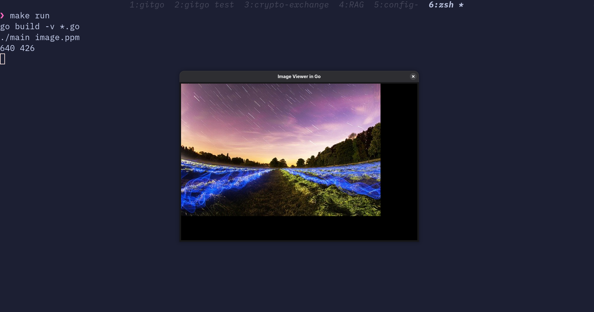

# Image Viewer in GO

Implemented an image viewer application in Go programming language using the Fyne library for the application.

Created image file parser for following file types:

- PPM
- BPM
- PNG

Here is the video how that works.

## Screenshot

